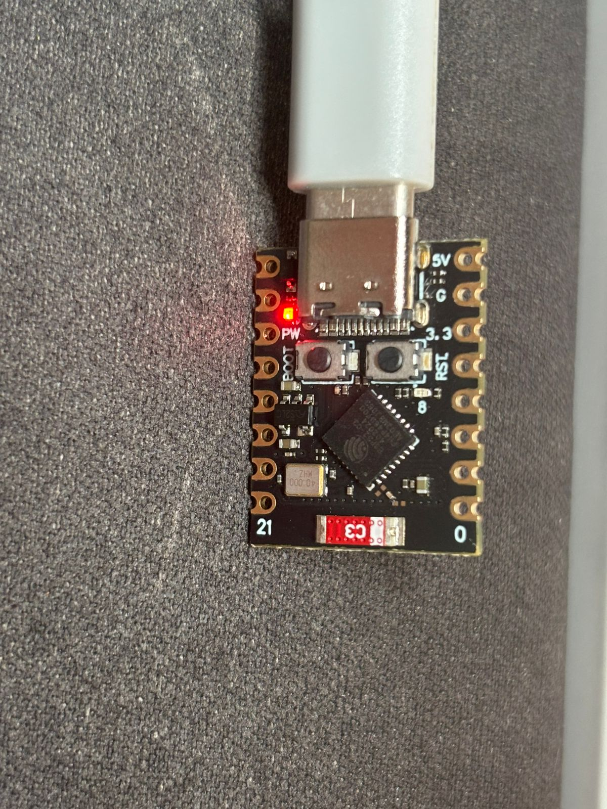
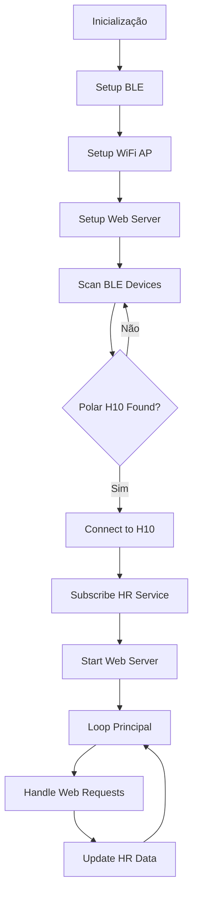

# Monitor Cardíaco ESP32-C3 + Polar H10 com Dashboard Web

> **Trabalho 2 - Projeto de Software e Hardware com Arduino/ESP32**  
> **Disciplina:** SSC0180 - Eletrônica para Computação	
> **Integrantes do Grupo:** 
- Christyan Paniago Nantes – Nº USP: 15635906
- Davi Gabriel Domingues – Nº USP: 15447497
- Giovanna Nascimento Noventa – Nº USP: 15637210

O objetivo do trabalho foi conectar um **ESP32-C3** com o sensor **Polar H10** via Bluetooth BLE e mostrar os batimentos cardíacos em tempo real numa página web. Tudo funciona direto no microcontrolador - ele faz a conexão BLE, cria uma rede Wi-Fi e serve uma interface web simples mas eficaz. A interface web contém o batimento atual, um gráfico recente e um "Zen Mode".

## Demonstração em Vídeo

**[Assista ao projeto funcionando aqui](https://www.youtube.com/XXXXXXXXX)**

*O vídeo contém:*
- O projeto montado e funcionando
- Explicação da arquitetura usada
- Demonstração da interface web em tempo real
- Teste com modo ZEN

---

## Esquema do Circuito

### Diagrama de Conexões

```
                    ESP32-C3 Dev Module
                   ┌─────────────────────┐
                   │                     │
    USB ──────────►│ USB/Serial          │
                   │                     │
                   │                     │
                   │                     │
    WiFi ─────────►│ WiFi Module         │◄────── Celular/PC
                   │                     │        (192.168.4.1) Ip padrão
                   │                     │
    BLE  ─────────►│ Bluetooth Module    │◄────── Polar H10
                   │                     │
                   │                     │
                   └─────────────────────┘
```

### Lista de Componentes

| Componente | Quantidade | Observações |
|------------|------------|-------------|
| ESP32-C3 Dev Module | 1 | Microcontrolador principal |
| Polar H10 | 1 | Sensor BLE de frequência cardíaca |
| Cabo USB Tipo-C | 1 | Para programação e alimentação |

---

## 📸 Imagens do Projeto

### Montagem Final

*ESP32-C3 conectado via USB sendo utilizado*

### Interface Web

*Página web mostrando os batimentos em tempo real*

### Polar H10 em Uso

*Cinta peitoral Polar H10 usada nos testes*

### Monitor Serial

*Dados sendo recebidos via Bluetooth no monitor serial*

---

---

## 💻 Software Desenvolvido

### Estrutura do Código

O projeto está organizado da seguinte forma:

```
Esp32-PolarH10
├───Readme.md
├───batimento_mockup.html
│
├───code 
│   │   code.ino (código principal)
│   │
│   └───data (arquivos estáticos para LittleFS (`chart.min.js`)
│           chart.min.js
│
└───images (As imagens usadas no README)
    ├───IMAGENS_NECESSARIAS.txt 
    ├───interface_web.png
    ├───monitor_serial.png
    ├───polar_h10_teste.jpg
    └───projeto_montado.jpg
 
```

### Uso do LittleFS para arquivos estáticos

Agora, a biblioteca Chart.js é servida diretamente do ESP32 usando o sistema de arquivos LittleFS. Isso permite que a interface web funcione **100% offline**.

#### Como enviar arquivos para o SPIFFS

1. **Coloque o arquivo `chart.min.js` na pasta `data/` do seu projeto.**
2. **Use o plugin de upload para LittleFS:**
   - Baixe e instale o plugin [Arduino ESP32 LittleFS/ESP32FS Uploader](https://github.com/earlephilhower/arduino-littlefs-upload).
   - Siga as instruções fornecidas no repositório acima
   
### Código Principal (`code/code.ino`)

O software foi desenvolvido em C++ usando a Arduino IDE e está dividido em módulos principais:

1. **Módulo BLE**: Gerencia scan, conexão e recepção de dados
2. **Módulo WiFi**: Configura access point e servidor web  
3. **Módulo Web**: Serve interface HTML com dados em tempo real
4. **Módulo Principal**: Coordena todos os módulos

**Principais bibliotecas utilizadas:**
### Bibliotecas Necessárias

> **⚠️ IMPORTANTE:** As bibliotecas não estão incluídas neste repositório. Baixe-as diretamente dos repositórios oficiais ou através do Gerenciador de Bibliotecas da Arduino IDE.

#### Bibliotecas Utilizadas (Versões Testadas):

#### 📁 Estrutura de Bibliotecas (Referência):

```
📁 Bibliotecas do Projeto:
├── 📁 NimBLE-Arduino (v2.3.1)     # ← Instalar manualmente
├── 📁 WiFi (v3.2.0)               # ← Já incluída no ESP32 Core  
├── 📁 Network (v3.2.0)            # ← Já incluída no ESP32 Core
├── 📁 WebServer (v3.2.0)          # ← Já incluída no ESP32 Core
└── 📁 FS (v3.2.0) [Verifique se realmente é usada]                 # ← Já incluída no ESP32 Core
#include <LittleFS.h>

```

1. **NimBLE-Arduino v2.3.1** 
   - **Função:** Comunicação Bluetooth Low Energy
   - **Instalação:** Gerenciador de Bibliotecas da Arduino IDE → Pesquisar "NimBLE-Arduino"
   - **Repositório:** https://github.com/h2zero/NimBLE-Arduino (Deve ser instalada manualmente)

2. **WiFi v3.2.0**
   - **Função:** Gerenciamento de rede WiFi  
   - **Instalação:** Incluída automaticamente com ESP32 Board Core v3.2.0

3. **Network v3.2.0**
   - **Função:** Camada de rede base
   - **Instalação:** Incluída automaticamente com ESP32 Board Core v3.2.0

4. **WebServer v3.2.0**
   - **Função:** Servidor HTTP
   - **Instalação:** Incluída automaticamente com ESP32 Board Core v3.2.0

5. **FS v3.2.0**
   - **Função:** Sistema de arquivos (para servir páginas web)
   - **Instalação:** Incluída automaticamente com ESP32 Board Core v3.2.0

#### Como Instalar as Bibliotecas:

1. **Abra a Arduino IDE**
2. **Vá em:** Sketch → Incluir Biblioteca → Gerenciar Bibliotecas
3. **Pesquise por:** "NimBLE-Arduino"
4. **Instale a versão 2.3.1** (ou superior compatível)
5. **As demais bibliotecas** (WiFi, Network, WebServer, FS) já vêm incluídas com o ESP32 Board Core v3.2.0

---

### Fluxo de Execução



## Como utilizar o projeto?

Basicamente, você coloca a cinta do Polar H10 no peito (idealmente umidificada), liga o ESP32, conecta no Wi-Fi que ele cria e pronto! Pode acompanhar seus batimentos em tempo real pelo navegador do celular ou computador.

---

## O que você vai precisar

### Hardware
- **ESP32-C3** (testei com o ESP32C3 Dev Module, mas outros devem funcionar)
- **Polar H10** (cinta peitoral da Polar)
- Um cabo USB para programar o ESP32
- Seu celular ou computador para acessar a interface web

### Software
- **Arduino IDE** (versão que suporte ESP32 Board Package v2.0.0+)
- **ESP32 Board Core** da Espressif (selecione `ESP32C3 Dev Module`)
- **Plugin de upload SPIFFS/LittleFS** ([arduino-littlefs-upload](https://github.com/earlephilhower/arduino-littlefs-upload))

## 🔄 Como funciona por baixo dos panos

```
[Polar H10 no peito] --Bluetooth--> [ESP32-C3] --Wi-Fi--> [Seu celular/PC]
                                         |
                                    Servidor Web
                                   (dados em tempo real)
```

O ESP32 fica "escutando" os dados do Polar H10 via Bluetooth Low Energy e ao mesmo tempo serve uma página web simples onde você pode ver os batimentos atualizando sozinhos.

---

## Como testar

1. **Carregue o código** no ESP32 e abre o Monitor Serial (115200 baud)
2. **Coloque a cinta Polar H10** no peito (umidificada)
3. **Conecte no Wi-Fi** `Monitor-Cardiaco` com a senha `12345678`
4. **Abre o navegador** e vá em `http://192.168.4.1/` 
5. **Funcionando** e veja os batimentos mudando na tela!

---

## Detalhes técnicos

- O Polar H10 usa o padrão Bluetooth GATT para frequência cardíaca (serviço `0x180D`)
- A cinta só consegue conectar com **um dispositivo por vez** (na configuração padrão), então se estiver conectada no celular, desconecte primeiro
- Se quiser conectar o esp32 a um wifi ao invés de criar um novo, troque `WiFi.softAP(...)` por `WiFi.begin(...)`

---

## Ideias Futuras para melhorar o projeto

- **WebSocket** para atualização mais suave (sem refresh na página)
- **Salvar dados** com timestamp para acompanhar o histórico
- **Enviar para a nuvem** (Algum Banco de dados) para análise a longo prazo
- **Alertas** quando os batimentos ficarem muito altos ou baixos
- **Usar SPIFFS/LittleFS** para armazenar arquivos HTML/CSS/JS no ESP32 (Fácil atualização da interface sem recompilar código)
- **Interpretação do HRV** O HRV pode ser utilizado para captar stress e outros aspectos físicos

---

## Links úteis

- [SDK Dos Sensores da Polar](https://github.com/polarofficial/polar-ble-sdk/tree/master)
- [NimBLE-Arduino no GitHub](https://github.com/h2zero/NimBLE-Arduino)
- [Plugin LittleFS Uploader](https://github.com/earlephilhower/arduino-littlefs-upload)

### Aprendizados Principais

- Comunicação Bluetooth Low Energy (BLE) com dispositivos biomédicos
- Desenvolvimento de servidores web embarcados  
- Integração de múltiplos protocolos (BLE + WiFi) em microcontroladores
- Interface web responsiva para IoT
- Gerenciamento de recursos em sistemas embarcados

### Desafios Superados

1. **Sincronização BLE**: Gerenciar conexão simultânea BLE + WiFi
2. **Parsing de dados**: Interpretar corretamente os dados do Polar H10
3. **Interface web**: Criar uma interface simples mas eficaz
4. **Placa defeituosa ESP32**: 1 dia de debugging para o problema ser de hardware

---

## Processo de Conexão BLE - Visão Geral

### Fluxo Completo: ESP32 ↔ Polar H10

O estabelecimento da conexão entre o ESP32 e o Polar H10 segue um protocolo BLE com múltiplas etapas:

```
┌─────────────────┐    ┌─────────────────┐    ┌─────────────────┐
│   1. SCANNING   │ => │  2. CONNECTION  │ => │ 3. SERVICE DISC │
│                 │    │                 │    │                 │
│ ESP32 procura   │    │ Estabelece      │    │ Encontra o      │
│ por dispositivos│    │ canal BLE       │    │ serviço 180D    │
│ BLE próximos    │    │ com Polar H10   │    │ (Heart Rate)    │
└─────────────────┘    └─────────────────┘    └─────────────────┘
                                                        │
         ┌──────────────────────────────────────────────┘
         │
         v
┌─────────────────┐    ┌─────────────────┐    ┌─────────────────┐
│4. CHARACTERISTIC│ => │ 5. NOTIFICATION │ => │  6. DATA FLOW   │
│                 │    │                 │    │                 │
│ Encontra a      │    │ Habilita as     │    │ Polar H10 envia │
│ característica  │    │ notificações    │    │ dados de HR     │
│ 2A37 (HR Data)  │    │ automáticas     │    │ automaticamente │
└─────────────────┘    └─────────────────┘    └─────────────────┘
```

### Detalhamento Técnico das Etapas

#### **Fase de Scanning**
```cpp
// ESP32 escuta por 30 segundos procurando dispositivos BLE
pBLEScan->start(30000, false, true);
```
- **Duração:** 30 segundos por ciclo
- **Método de descoberta:** MAC address específico (`a0:9e:1a:e4:c5:6b`)
- **Fallbacks:** Nome "Polar", serviço HR (180D), manufacturer ID (107)

#### **Estabelecimento da Conexão**
```cpp
// Múltiplas tentativas com parâmetros progressivos, para tentar acertar a janela de advertasing do sensor
pClient->connect(polarH10Device, true, false, false);
```
- **Tentativas:** Up to 6 attempts with exponential backoff
- **Parâmetros de conexão:** Ajustados para otimizar a conexão com Polar H10
- **MTU Negotiation:** Negocia 232 bytes (vs 23 bytes padrão) para transferência eficiente de dados estendidos
  - **MTU padrão (23 bytes):** Suficiente para HR básico + poucos RR intervals
  - **MTU otimizado (232 bytes):** Permite HR + múltiplos RR intervals + dados extras em um único pacote
  - **Benefício:** Reduz latência e melhora eficiência energética

#### **Descoberta de Serviços**
```cpp
// Busca pelo serviço padrão de Heart Rate
pService = pClient->getService(NimBLEUUID("180D"));
```
- **Serviço alvo:** `0x180D` (Heart Rate Service - padrão BLE)
- **Handle descoberto:** Normalmente handle 14

#### **Descoberta de Características**
```cpp
// Encontra a característica de medição de HR
pRemoteCharacteristic = pService->getCharacteristic(NimBLEUUID("2A37"));
```
- **Característica alvo:** `0x2A37` (Heart Rate Measurement)

#### **Habilitação de Notificações**
```cpp
// Ativa notificações automáticas de dados
pRemoteCharacteristic->subscribe(true, notifyCallback);
```
- **Descriptor usado:** `0x2902` (Client Characteristic Configuration)
- **Valor escrito:** `0x0001` (enable notifications)
- **Callback registrado:** `notifyCallback()` para processar dados

#### **Fluxo de Dados Contínuo**
```cpp
// Callback executado automaticamente a cada batimento
void notifyCallback(uint8_t *pData, size_t length, bool isNotify) {
    // Parse do formato BLE Heart Rate Service
    uint8_t flags = pData[0];
    int hr = (flags & 0x01) ? (pData[1] | (pData[2] << 8)) : pData[1];
}
```

### Tratamento de Erros e Reconexão

#### Sistema de Retry Inteligente
- **Tentativas de conexão:** 6 attempts com delays progressivos (400ms, 600ms, 800ms...)
- **Reset de stack BLE:** A cada 4 tentativas para limpar estado
- **Timeout global:** 2 minutos antes de reiniciar o scanning
- **Monitoramento de saúde:** Reconecta se não receber dados por 45 segundos

#### Gerenciamento de Estado
```cpp
// Estados principais monitorados
bool scanActive = true;           // Scanning em andamento
bool deviceConnected = false;     // Conexão BLE estabelecida  
String connectionStatus;          // Status para display web
```

### Otimizações Implementadas

#### Parâmetros BLE Otimizados
- **MTU:** 232 bytes (10x maior que padrão)
- **Data Length:** 185 bytes (Data Length Extension)
- **Connection Interval:** 50-100ms (balanceado para HR)

#### Estratégias de Timing
- **Delay pré-conexão:** Aumenta progressivamente (400ms + retries*200ms)
- **Spacing entre tentativas:** 8 segundos para respeitar ciclo de advertising
- **Stabilization delay:** 500ms após conexão bem-sucedida

### Indicadores de Status na Interface Web

| Status | Cor | Significado |
|--------|-----|-------------|
| **Scanning...** | 🟡 Amarelo | Procurando por Polar H10 |
| **Connecting...** | 🟠 Laranja | Tentando estabelecer conexão |
| **Connected** | 🟢 Verde | Recebendo dados de HR |
| **Connection Failed** | 🔴 Vermelho | Erro na conexão, tentando novamente |

---

### Troubleshooting de Conexão

#### Problemas Comuns:
1. **"No HR data received in 45 seconds"** → Verificar contato da cinta no peito
2. **"Connection failed; status=13"** → Timeout - normal, sistema tentará novamente

#### Soluções:
- Umidificar a cinta peitoral para melhor contato
- Desconectar Polar H10 de outros dispositivos (celular/apps) Ou ativar a conexão simultânea de 2 dispositivos (Aplicativos da Polar)
- Aguardar - o sistema tem retry automático inteligente Ou Resetar o ESP32 pelo botão físico
