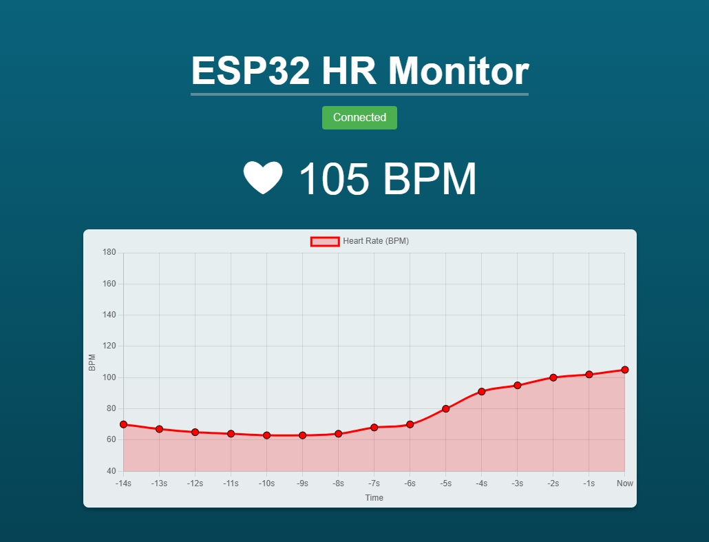
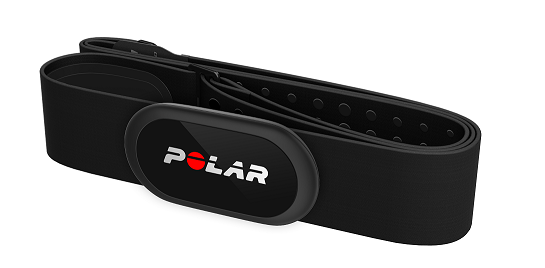
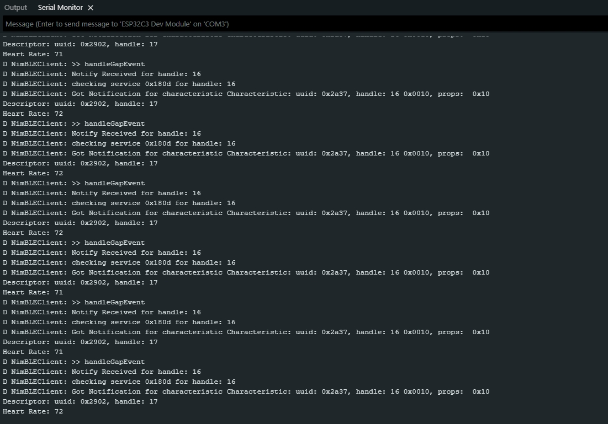
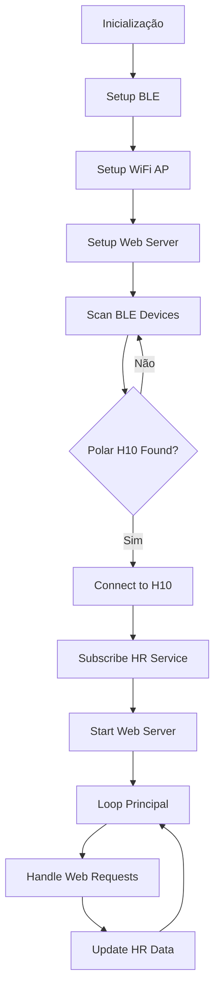

# Monitor Cardíaco ESP32-C3 + Polar H10 com Dashboard Web

> **Trabalho 2 - Projeto de Software e Hardware com Arduino/ESP32**  
> **Disciplina:** SSC0180 - Eletrônica para Computação  

## Sumário
- [Visão Geral](#visão-geral)
- [Demonstração](#demonstração)
- [Pré-requisitos](#pré-requisitos)
- [Estrutura do Projeto](#estrutura-do-projeto)
- [Configuração e Build](#configuração-e-build)
- [Como Usar](#como-usar)
- [Detalhes Técnicos](#detalhes-técnicos)
- [Solução de Problemas](#solução-de-problemas)
- [Referências](#referências)
- [Extras](#extras)

## Visão Geral

**Integrantes do Grupo:** 
- Christyan Paniago Nantes – Nº USP: 15635906
- Davi Gabriel Domingues – Nº USP: 15447497
- Giovanna Nascimento Noventa – Nº USP: 15637210

O objetivo do trabalho foi conectar um **ESP32-C3** com o sensor **Polar H10** via Bluetooth BLE e mostrar os batimentos cardíacos em tempo real numa página web. Tudo funciona direto no microcontrolador - ele faz a conexão BLE, cria uma rede Wi-Fi e serve uma interface web simples mas eficaz. A interface web contém o batimento atual e um gráfico recente.

## Demonstração

**[Assista ao projeto funcionando aqui](https://www.youtube.com/XXXXXXXXX)**

*O vídeo contém:*
- O projeto montado e funcionando
- Explicação da arquitetura usada
- Demonstração da interface web em tempo real

---

## Esquema do Circuito

### Diagrama de Conexões

```
                    ESP32-C3 Dev Module
                   ┌─────────────────────┐
                   │                     │
    USB ──────────►│ USB/Serial          │
                   │                     │
                   │                     │
                   │                     │
    WiFi ─────────►│ WiFi Module         │◄────── Celular/PC
                   │                     │        (192.168.4.1) Ip padrão
                   │                     │
    BLE  ─────────►│ Bluetooth Module    │◄────── Polar H10
                   │                     │
                   │                     │
                   └─────────────────────┘
```

### Lista de Componentes

| Componente | Quantidade | Observações |
|------------|------------|-------------|
| ESP32-C3 Dev Module | 1 | Microcontrolador principal |
| Polar H10 | 1 | Sensor BLE de frequência cardíaca |
| Cabo USB Tipo-C | 1 | Para programação e alimentação |

---

## Imagens do Projeto

### Montagem Final


*ESP32-C3 conectado via USB sendo utilizado*

### Interface Web


*Página web mostrando os batimentos em tempo real*

### Polar H10 em Uso


*Cinta peitoral Polar H10 usada nos testes*

### Monitor Serial


*Dados sendo recebidos via Bluetooth no monitor serial*

---

## Pré-requisitos

### Hardware Necessário
- **ESP32-C3 Dev Module** (ou variante compatível)
- **Polar H10** - Cinta peitoral com sensor BLE
- **Cabo USB Tipo-C** - Para programação e alimentação
- **Dispositivo para acesso** - Celular ou computador para acessar a interface web

### Software Necessário
- **Arduino IDE** (v2.0.0+ com suporte ESP32)
- **ESP32 Board Core v3.2.0+** da Espressif
- **Plugin LittleFS Upload** - [arduino-littlefs-upload](https://github.com/earlephilhower/arduino-littlefs-upload)

### Bibliotecas (Dependências)

> **IMPORTANTE:** Apenas a biblioteca NimBLE-Arduino precisa ser instalada manualmente. As demais já estão incluídas no ESP32 Core.

#### Biblioteca Principal (Instalação Manual):
- **NimBLE-Arduino v2.3.1+**
  - **Função:** Comunicação Bluetooth Low Energy com Polar H10
  - **Instalação:** Arduino IDE → Gerenciar Bibliotecas → Pesquisar "NimBLE-Arduino"
  - **Repositório:** https://github.com/h2zero/NimBLE-Arduino

#### Bibliotecas do Sistema (Já Incluídas):
- **WiFi, Network, WebServer** - Rede e servidor HTTP
- **FS, LittleFS** - Sistema de arquivos para servir Chart.js offline
- **Networking** - Abstrações TCP/IP de baixo nível

---

## Estrutura do Projeto

```
Esp32-PolarH10/
├── Readme.md                    # Documentação do projeto
├── batimento_mockup.html       # Protótipo da interface web
├── code/
│   ├── code.ino                # Código principal do ESP32
│   └── data/                   # Arquivos para LittleFS
│       └── chart.min.js        # Chart.js offline
└── images/                     # Imagens da documentação
    ├── interface_web.png
    ├── monitor_serial.png
    ├── polar_h10_teste.jpg
    └── projeto_montado.jpg
```

### Arquitetura do Código (`code.ino`)

O software está organizado 4 blocos principais:

1. **BLE** - Gerencia descoberta, conexão e dados do Polar H10
2. **WiFi** - Configura access point
3. **Web** - Serve interface HTML com Chart.js
4. **Loop Principal** - Coordena todos os módulos

---

## Configuração e Build

### 1. Preparação do Ambiente

```bash
# 1. Instale a Arduino IDE 2.0+
# 2. Adicione o ESP32 Board Manager:
#    File → Preferences → Additional Board Manager URLs:
#    https://espressif.github.io/arduino-esp32/package_esp32_index.json

# 3. Instale ESP32 Board Core (v3.2.0+):
#    Tools → Board → Boards Manager → ESP32

# 4. Instale NimBLE-Arduino:
#    Tools → Manage Libraries → Search "NimBLE-Arduino"
```

### 2. Upload dos Arquivos LittleFS

A biblioteca Chart.js deve ser carregada no sistema de arquivos do ESP32:

```bash
# 1. Coloque chart.min.js na pasta code/data/
# 2. Instale arduino-littlefs-upload plugin: https://github.com/earlephilhower/arduino-littlefs-upload
# 3. Envie seguindo as instruções do plugin
```

### 3. Configuração da Placa

```
Board: "ESP32C3 Dev Module"
Upload Speed: "921600"
CPU Frequency: "160MHz"  
Flash Mode: "QIO"
Flash Size: "4MB (3MB APP/1MB SPIFFS)"
Partition Scheme: "HUGEAPP"
```

### 4. Compilação e Upload

```bash
# 1. Abra code/code.ino na Arduino IDE
# 2. Verifique se todas as bibliotecas estão instaladas
# 3. Verifique as configurações da placa
# 4. Upload: Ctrl+U
# 5. Upload LittleFS: [Ctrl] + [Shift] + [P] then "Upload LittleFS to Pico/ESP8266/ESP32"
```

---

## Como Usar

### 1. Preparação do Polar H10
- Coloque a cinta peitoral no peito (preferencialmente umidificada)
- Certifique-se que não está conectado a outros dispositivos (Ou ative a conexão com 2 dispositivos nos app da Polar)

### 2. Inicialização do ESP32
- Conecte o ESP32 via USB e faça upload do código
- Abra o Monitor Serial (115200 baud) para debug

### 3. Conexão e Acesso
- **Conecte no WiFi:** `ESP32-HeartRate`
- **Acesse:** http://192.168.4.1 no navegador
- **Aguarde:** A conexão BLE com Polar H10 (pode levar 1-2 minutos)

### 4. Interface Web
- **Status de Conexão:** Cores indicam o estado (Amarelo Scanning → Verde Connected)
- **Batimentos:** Valor atual em BPM
- **Gráfico:** Histórico dos últimos 15 pontos
- **Atualização:** Automática a cada batimento detectado

---

## Detalhes Técnicos

### Fluxo de Execução Sistema



### Protocolo BLE - Conexão com Polar H10

O estabelecimento da conexão segue um protocolo BLE estruturado:

```
                  ┌─────────────────┐    ┌─────────────────┐    ┌─────────────────┐
                  │   1. SCANNING   │ => │  2. CONNECTION  │ => │ 3. SERVICE DISC │
                  │                 │    │                 │    │                 │
                  │ ESP32 procura   │    │ Estabelece      │    │ Encontra o      │
                  │ por dispositivos│    │ canal BLE       │    │ serviço 180D    │
                  │ BLE próximos    │    │ com Polar H10   │    │ (Heart Rate)    │
                  └─────────────────┘    └─────────────────┘    └─────────────────┘
                                                                          │
                           ┌──────────────────────────────────────────────┘
                           │
                           v
                  ┌─────────────────┐    ┌─────────────────┐    ┌─────────────────┐
                  │4. CHARACTERISTIC│ => │ 5. NOTIFICATION │ => │  6. DATA FLOW   │
                  │                 │    │                 │    │                 │
                  │ Encontra a      │    │ Habilita as     │    │ Polar H10 envia │
                  │ característica  │    │ notificações    │    │ dados de HR     │
                  │ 2A37 (HR Data)  │    │ automáticas     │    │ automaticamente │
                  └─────────────────┘    └─────────────────┘    └─────────────────┘
```

#### Parâmetros BLE Otimizados
- **MTU:** 232 bytes (vs 23 padrão) - Permite mais dados por pacote
- **Connection Interval:** 50-100ms - Balanceado para Heart Rate
- **Data Length Extension:** 185 bytes - Melhora throughput
- **Retry System:** 6 tentativas com backoff exponencial

#### Indicadores de Status Web
| Status | Cor | Significado |
|--------|-----|-------------|
| **Scanning...** | Amarelo | Procurando Polar H10 |
| **Connecting...** | Laranja | Estabelecendo conexão |
| **Connected** | Verde | Recebendo dados HR |
| **Connection Failed** | Vermelho | Erro - tentando reconectar |

### Sistema Web Embarcado
- **Access Point:** `ESP32-HeartRate` (192.168.4.1)
- **Servidor HTTP:** Baseado em WebServer.h
- **Arquivos Estáticos:** Servidos via LittleFS (Chart.js offline)

---

## Solução de Problemas

### Problemas de Conexão BLE
**Sintomas:** Status sempre em "Scanning" ou "Connection Failed"

**Soluções:**
1. **Umidificar a cinta** - Melhora contato com a pele
2. **Desconectar outros dispositivos** - Polar H10 (Ou ative a conexão com 2 dispositivos nos app da Polar)
3. **Aguardar pacientemente** - Sistema tem retry automático inteligente
4. **Reset físico** - Botão RESET no ESP32

### Problemas de WiFi
**Sintomas:** Não consegue conectar no AP do ESP32

**Soluções:**
1. **Verificar SSID** - Deve aparecer "ESP32-HeartRate"
2. **Proximidade** - Ficar próximo ao ESP32
3. **Limpar cache** - Forget network e reconectar
4. **Tentar outro dispositivo** - Teste com celular/computador diferente

### Problemas na Interface Web
**Sintomas:** Página não carrega ou gráfico não aparece

**Soluções:**
1. **Verificar Chart.js** - Deve estar em `data/chart.min.js`
2. **Upload LittleFS** - Executar "ESP32 LittleFS Data Upload"
3. **Refresh completo** - Ctrl+F5 no navegador
4. **Monitor Serial** - Verificar logs de erro

### Debug via Monitor Serial
```bash
# Configurações importantes:
Baud Rate: 115200
# Mensagens importantes a procurar:
- "LittleFS mounted successfully"
- "File found: /chart.min.js"
- "WiFi AP Started"
- "BLE Device found: Polar H10"
- "Connected to Polar H10"
```

---

## Melhorias Futuras

### Melhorias Técnicas
- **WebSocket** - Comunicação real-time sem reset HTTP
- **Persistência de dados** - Salvar histórico com timestamp
- **Integração na nuvem** - Upload para banco de dados remoto
- **Interface no LittleFS** - HTML/CSS/JS servidos do ESP32

### Funcionalidades Avançadas  
- **Alertas inteligentes** - Batimentos anômalos (arritmia através dos intervalos RR)
- **Análise HRV** - Pode ser utilizado para diversas métricas como stress e diversos aspectos de saúde 

### Otimizações de Performance
- **Gestão de energia** - Deep sleep quando inativo  
- **Dual-core** - BLE no Core 0, WiFi no Core 1

---

## Referências

### Links Principais
- **[Polar BLE SDK](https://github.com/polarofficial/polar-ble-sdk)** - Documentação oficial dos sensores Polar
- **[NimBLE-Arduino](https://github.com/h2zero/NimBLE-Arduino)** - Biblioteca BLE otimizada para ESP32  
- **[LittleFS Uploader](https://github.com/earlephilhower/arduino-littlefs-upload)** - Plugin para upload de arquivos

## Extras

### Aprendizados Principais
- **Comunicação BLE** - Protocolos GATT, características e notificações
- **Servidores embarcados** - HTTP server em microcontroladores
- **Multitasking** - Gerenciar BLE + WiFi simultaneamente  
- **Sistemas real-time** - Processamento de dados de sensores

### Desafios Superados
1. **Parsing de dados Polar** - Interpretar formato proprietário do H10
2. **Interface responsiva** - Design funcional em dispositivos móveis
3. **Hardware debugging** - Identificar ESP32 defeituoso

### Resultados Alcançados
- **100% Offline** - Funciona sem internet (Chart.js local)
- **Baixa latência** - Dados em tempo real via BLE otimizado
