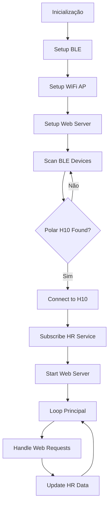

# 💓 Monitor Cardíaco ESP32-C3 + Polar H10 com Dashboard Web

> **Trabalho 2 - Projeto de Software e Hardware com Arduino/ESP32**  
> **Disciplina:** SSC0180 - Eletrônica para Computação	
> **Integrantes do Grupo:** 
- Christyan Paniago Nantes – Nº USP: 15635906
- Davi Gabriel Domingues – Nº USP: 15447497
- Giovanna Nascimento Noventa – Nº USP: 15637210

O objetivo do trabalho foi conectar um **ESP32-C3** com o sensor **Polar H10** via Bluetooth BLE e mostrar os batimentos cardíacos em tempo real numa página web. Tudo funciona direto no microcontrolador - ele faz a conexão BLE, cria uma rede Wi-Fi e serve uma interface web simples mas eficaz. A interface web contém o batimento atual, um gráfico recente e um "Zen Mode".

## Demonstração em Vídeo

**[Assista ao projeto funcionando aqui](https://www.youtube.com/XXXXXXXXX)**

*O vídeo contém:*
- O projeto montado e funcionando
- Explicação da arquitetura usada
- Demonstração da interface web em tempo real
- Teste com modo ZEN

---

## Esquema do Circuito

### Diagrama de Conexões

```
                    ESP32-C3 Dev Module
                   ┌─────────────────────┐
                   │                     │
    USB ──────────►│ USB/Serial          │
                   │                     │
                   │                     │
                   │                     │
    WiFi ─────────►│ WiFi Module         │◄────── Celular/PC
                   │                     │        (192.168.4.1) Ip padrão
                   │                     │
    BLE  ─────────►│ Bluetooth Module    │◄────── Polar H10
                   │                     │
                   │                     │
                   └─────────────────────┘
```

### Lista de Componentes

| Componente | Quantidade | Observações |
|------------|------------|-------------|
| ESP32-C3 Dev Module | 1 | Microcontrolador principal |
| Polar H10 | 1 | Sensor BLE de frequência cardíaca |
| Cabo USB Tipo-C | 1 | Para programação e alimentação |

---

## 📸 Imagens do Projeto

### Montagem Final

*ESP32-C3 conectado via USB sendo utilizado*

### Interface Web

*Página web mostrando os batimentos em tempo real*

### Polar H10 em Uso

*Cinta peitoral Polar H10 usada nos testes*

### Monitor Serial

*Dados sendo recebidos via Bluetooth no monitor serial*

---

---

## 💻 Software Desenvolvido

### Estrutura do Código

O projeto está organizado da seguinte forma:

```
📁 Esp32-PolarH10/
├── 📄 code/code.ino                # Código principal do ESP32
├── 📁 libraries/                   # Bibliotecas necessárias (Não incluídas)
│   ├── 📁 NimBLE-Arduino v2.3.1/   # Biblioteca do BLE
│   ├── 📁 WebServer v3.2.0/        # Biblioteca do Servidor web
│   ├── 📁 Network v3.2./0          # Biblioteca da Camada de rede base
│   ├── 📁 WiFi v3.2.0/             # Biblioteca do Gerenciamento de rede WiFi
│   ├── 📁 FS v3.2.0/               # Biblioteca do Sistema de arquivos (para servir páginas web)
│
├── 📄 Readme.md    	            # Este arquivo
└── 📁 images/                      # Imagens do projeto
```

### Código Principal (`code/code.ino`)

O software foi desenvolvido em C++ usando a Arduino IDE e está dividido em módulos funcionais:

1. **Módulo BLE**: Gerencia scan, conexão e recepção de dados
2. **Módulo WiFi**: Configura access point e servidor web  
3. **Módulo Web**: Serve interface HTML com dados em tempo real
4. **Módulo Principal**: Coordena todos os módulos

**Principais bibliotecas utilizadas:**
### 📚 Bibliotecas Necessárias

> **⚠️ IMPORTANTE:** As bibliotecas não estão incluídas neste repositório. Baixe-as diretamente dos repositórios oficiais ou através do Gerenciador de Bibliotecas da Arduino IDE.

#### Bibliotecas Utilizadas (Versões Testadas):

#### 📁 Estrutura de Bibliotecas (Referência):

```
📁 Bibliotecas do Projeto:
├── 📁 NimBLE-Arduino (v2.3.1)     # ← Instalar manualmente
├── 📁 WiFi (v3.2.0)               # ← Já incluída no ESP32 Core  
├── 📁 Network (v3.2.0)            # ← Já incluída no ESP32 Core
├── 📁 WebServer (v3.2.0)          # ← Já incluída no ESP32 Core
└── 📁 FS (v3.2.0)                 # ← Já incluída no ESP32 Core
```

1. **NimBLE-Arduino v2.3.1** 
   - **Função:** Comunicação Bluetooth Low Energy
   - **Instalação:** Gerenciador de Bibliotecas da Arduino IDE → Pesquisar "NimBLE-Arduino"
   - **Repositório:** https://github.com/h2zero/NimBLE-Arduino (Deve ser instalada manualmente)

2. **WiFi v3.2.0**
   - **Função:** Gerenciamento de rede WiFi  
   - **Instalação:** Incluída automaticamente com ESP32 Board Core v3.2.0

3. **Network v3.2.0**
   - **Função:** Camada de rede base
   - **Instalação:** Incluída automaticamente com ESP32 Board Core v3.2.0

4. **WebServer v3.2.0**
   - **Função:** Servidor HTTP
   - **Instalação:** Incluída automaticamente com ESP32 Board Core v3.2.0

5. **FS v3.2.0**
   - **Função:** Sistema de arquivos (para servir páginas web)
   - **Instalação:** Incluída automaticamente com ESP32 Board Core v3.2.0

#### Como Instalar as Bibliotecas:

1. **Abra a Arduino IDE**
2. **Vá em:** Sketch → Incluir Biblioteca → Gerenciar Bibliotecas
3. **Pesquise por:** "NimBLE-Arduino"
4. **Instale a versão 2.3.1** (ou superior compatível)
5. **As demais bibliotecas** (WiFi, Network, WebServer, FS) já vêm incluídas com o ESP32 Board Core v3.2.0


---

### Fluxo de Execução


```mermaid
graph TD
    A[Inicialização] --> B[Setup BLE]
    B --> C[Setup WiFi AP]
    C --> D[Setup Web Server]
    D --> E[Scan BLE Devices]
    E --> F{Polar H10 Found?}
    F -->|Não| E
    F -->|Sim| G[Connect to H10]
    G --> H[Subscribe HR Service]
    H --> I[Start Web Server]
    I --> J[Loop Principal]
    J --> K[Handle Web Requests]
    K --> L[Update HR Data]
    L --> J
```

## Como utilizar o projeto?

Basicamente, você coloca a cinta do Polar H10 no peito (idealmente umidificada), liga o ESP32, conecta no Wi-Fi que ele cria e pronto! Pode acompanhar seus batimentos em tempo real pelo navegador do celular ou computador.

---

## O que você vai precisar

### Hardware
- **ESP32-C3** (testei com o ESP32C3 Dev Module, mas outros devem funcionar)
- **Polar H10** (cinta peitoral da Polar)
- Um cabo USB para programar o ESP32
- Seu celular ou computador para acessar a interface web

### Software
- **Arduino IDE** (versão que suporte ESP32 Board Package v2.0.0+)
- **ESP32 Board Core** da Espressif (selecione `ESP32C3 Dev Module`)


## 🔄 Como funciona por baixo dos panos

```
[Polar H10 no peito] --Bluetooth--> [ESP32-C3] --Wi-Fi--> [Seu celular/PC]
                                         |
                                    Servidor Web
                                   (dados em tempo real)
```

O ESP32 fica "escutando" os dados do Polar H10 via Bluetooth Low Energy e ao mesmo tempo serve uma página web simples onde você pode ver os batimentos atualizando sozinhos.

---

## Como testar

1. **Carregue o código** no ESP32 e abre o Monitor Serial (115200 baud)
2. **Coloque a cinta Polar H10** no peito (umidificada)
3. **Conecte no Wi-Fi** `Monitor-Cardiaco` com a senha `12345678`
4. **Abre o navegador** e vai em `http://192.168.4.1/` 
5. **Funcionando** e veja os batimentos mudando na tela!

---

## Detalhes técnicos

- O Polar H10 usa o padrão Bluetooth GATT para frequência cardíaca (serviço `0x180D`)
- A cinta só consegue conectar com **um dispositivo por vez** (na configuração padrão), então se estiver conectada no celular, desconecte primeiro
- Se quiser conectar o esp32 a um wifi ao invés de criar um novo, troque `WiFi.softAP(...)` por `WiFi.begin(...)`

---

## Ideias Futuras para melhorar o projeto

- **WebSocket** para atualização mais suave (sem refresh na página)
- **Salvar dados** com timestamp para acompanhar o histórico
- **Enviar para a nuvem** (Algum Banco de dados) para análise a longo prazo
- **Alertas** quando os batimentos ficarem muito altos ou baixos
- **Usar SPIFFS** para armazenar arquivos HTML/CSS/JS no ESP32 (Fácil atualização da interface sem recompilar código)
- **Interpretação do HRV** O HRV pode ser utilizado para captar stress e outros aspectos físicos

---

## Links úteis

- [SDK Dos Sensores da Polar](https://github.com/polarofficial/polar-ble-sdk/tree/master)
- [NimBLE-Arduino no GitHub](https://github.com/h2zero/NimBLE-Arduino)

### Aprendizados Principais

- Comunicação Bluetooth Low Energy (BLE) com dispositivos biomédicos
- Desenvolvimento de servidores web embarcados  
- Integração de múltiplos protocolos (BLE + WiFi) em microcontroladores
- Interface web responsiva para IoT
- Gerenciamento de recursos em sistemas embarcados

### Desafios Superados

1. **Sincronização BLE**: Gerenciar conexão simultânea BLE + WiFi
2. **Parsing de dados**: Interpretar corretamente os dados do Polar H10
3. **Interface web**: Criar uma interface simples mas eficaz
4. **Placa defeituosa ESP32**: 1 dia de debugging para o problema ser de hardware
